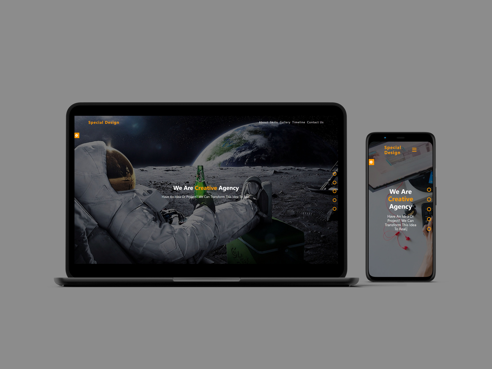

# **Create Agency Landing Page**

**Live demo** [click here](https://creative-special-agency-page.netlify.app/)

---

### **Description:**

The **Create Agency Landing Page** is a visually appealing and interactive single-page website designed for showcasing agency services. Built with **HTML**, **CSS**, and **JavaScript**, the page offers an engaging experience with smooth animations, interactive elements, and a customizable interface.

---

### **Features:**

1. **Interactive Color Theme:**

    - Users can dynamically change the color scheme of the page to suit their preferences, enhancing personalization.

2. **Elegant Animations:**

    - The page incorporates smooth and eye-catching animations for elements like text, images, and sections, creating a professional and engaging experience.

3. **Content Display:**

    - Structured sections that effectively highlight agency services, team, portfolio, and client testimonials, all presented with clean visuals.

4. **Responsive Design:**
    - The layout adjusts seamlessly across devices, ensuring an optimized experience for both desktop and mobile users.

---

### **Technologies Used:**

-   **HTML:**
-   **CSS:**
-   **JavaScript:**

---

### **Conclusion:**

The **Create Agency Landing Page** is a modern and interactive platform designed to showcase the services and values of an agency. Its combination of dynamic features, responsive design, and aesthetic animations makes it an excellent tool for attracting and engaging potential clients.
